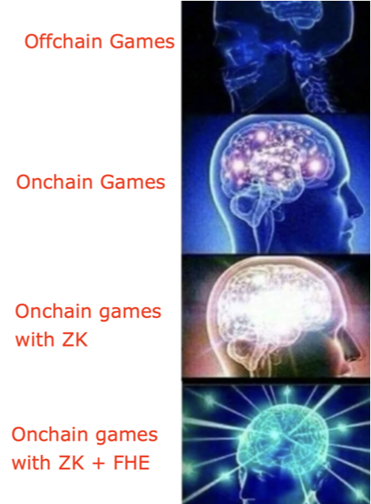

# Stealth Command: The Hidden Fronts (INCO Flavor)

The same game contract with minor changes (based on library used) is deployed both on FHENIX and INCO (`@fhenixprotocol/contracts/FHE.sol` for FHENIX and `fhevm/lib/TFHE.sol` for INCO)

* FHENIX SUBMISSION  - https://github.com/Switch-Labs/stealth_command
* INCO SUBMISSION (This Repository) -  https://github.com/Switch-Labs/stealth_command_inco

### Table of Contents

- [Stealth Command: The Hidden Fronts](#stealth-command--the-hidden-fronts)
  * [Background:](#background)
  * [Art of war - an introduction to "Stealth Command".](#art-of-war---an-introduction-to--stealth-command)
  * [Comparison of ZK and FHE implementation](#comparison-of-zk-and-fhe-implementation)
    + [How it worked in ZK:](#how-it-worked-in-zk)
    + [How it works with FHE](#how-it-works-with-fhe)
    + [Advantages of using FHE:](#advantages-of-using-fhe)
    + [Future Version of the game - ZK + FHE](#future-version-of-the-game---zk---fhe)
    + [How to run these contracts](#how-to-run-these-contracts)
    + [Implementation Progress](#implementation-progress)
    + [Deployed Contract](#deployed-contract-address-in-inco)


## Background:

The initial edition of the game ["Shadow Warfare: Cities Under Siege"](https://ethglobal.com/showcase/shadow-warfare-gxvty) was developed during EthGlobal's Circuitbreaker hackathon of February 2024. The game logic contracts and the proof verification contracts were deployed on Scroll, the game's circuits were implemented in Noir. ZK circuits were integral for ensuring both privacy, simulating a "fog of war" effect, and scalability, through off-chain computation of the battle logic.


"Stealth Command: The Hidden Fronts" is a revamped version of the game, now employing Fully Homomorphic Encryption (FHE) for encryption and privacy, in place of ZK. This project serves as an investigation into the comparative effectiveness of ZK and FHE. In this iteration, game state computation is executed on-chain, to keep things simple.

```
Note: This (FHE) implementation was built from scratch for this ETH Denver BUIDL week. The older (ZK)implementation is referred for a comparative study.
```

## Art of war - an introduction to "Stealth Command".

In this game, each participant assumes ownership of a city upon joining. Immediately, they are tasked with commanding and fortifying their city, ensuring its defenses remain confidential. The defense mechanisms are encrypted and stored on-chain as hashes, representing the city's defenses. Conversely, when attacking, players utilize a public army, with battle computations carried out entirely on-chain using encrypted data to keep city's defense private through the Homomorphic Encryption over the Torus (TFHE) library.

A unique aspect of the game is the controlled leak of information based on the defending army's performance—either holding or losing the city. This feature introduces a layer of strategic depth, allowing players to analyze defense histories and make informed predictions about city defenses, akin to real-world military strategies.

Furthermore, to maintain fairness and adherence to the game's rules, both attacking and defending armies undergo on-chain verification. This process ensures all players comply with the established guidelines, preventing any form of cheating and preserving the game's integrity.

## Comparison of ZK and FHE implementation 

Before we can compare ZK vs FHE, we must explain how the game worked in ZK: 

### How it worked in ZK:
<br>


In Step 1, Player 1 sets up his defense for the city, which is kept private. Only the defense hash is stored on-chain to keep him honest, and to make sure he cannot change it later.


In Step 2, Player 2 attacks the city of Player 1. The attacking army composition is Public.  


In Step 3, Player 1 computes the battle result off-chain, and generates a proof of that computation along with the result. 
The Proof is verified on-chain and the result is stored on-chain.  


In Optional Step 4, in case Player 1 ghosts, we let Player 2 collect forfeir (loot city) aafter a certain time period.

### How it works with FHE 
<br>

Using FHE is a much simpler developer experience:

In Step 1, Player 1 generates a cyphertext for his/her defense using the fhevm.js library on the client computer, and then pass it on as a calldata on to the deployed smart contract, where it is verified and stored as ecrypted data.


In Step 2, Player 2 attacks the city publicly. Since the data is already on-chain and we can compute with encrypted data, the battle is computed on-chain.


### Advantages of using FHE: 

As you can see, it was much easier and straightforward to use FHE. we could implement the same game in two simple steps instead of four:

We also eliminated the need of Player 1 (the defender) having to compute the battle and generate the proof - improving user experience.

Moreover, we also eliminated the need of off-chain storage.All states stay on-chain and we can scale the game easily for a true on-chain multiplayer experience.

### Future Version of the game - ZK + FHE 

Does this mean FHE replaces all things ZK? The answer is no. Even the TFHE library uses ZK proofs verification of incoming cyphertexts underneath the hood before storing the encrypted data on-chain. 

Moreover, as the battle game logic becomes more complicated, it might be prudent to move that out for off-chain computation to save on gas fees, where we can generate a ZK proof of that battle on client computer, and verify the result on-chain. We can make the battle a lot more computationally intensive that way. 

FHE excels in privacy and encryption, and ZK is good for verifiable off-chain computation.



### How to run these contracts (Inco Network)

STEP 1: clone & install dependencies

```
git clone https://github.com/Switch-Labs/stealth_command_inco.git
cd stealth_command_inco
pnpm install
```

STEP 2: compile and generate types
```
pnpm compile
pnpm typechain
```

STEP 3: Could not get local node working, so all deployments and tests are done against testnet

```

```

Deploy on testnet: 

```
pnpm deploy:contracts --network inco
```

Finally run the tests! 

Make sure attacker and defender accounts have tokens for gas!! 

```
pnpm hardhat --network inco test
```

### Implementation Progress

* :white_check_mark: Successfully import ZK logic to FHE
* :white_check_mark: Compile Contracts
* :white_check_mark: Deploy Contract Locally
* :white_check_mark: Deploy Contract in Testnet
* :white_check_mark: Add Unit Tests
* :white_check_mark: End to End testing for battles
* :x: UI 


### Deployed Contract Address in INCO
0x14fAa5686cC9bc489666295Fef570ab96afCf179